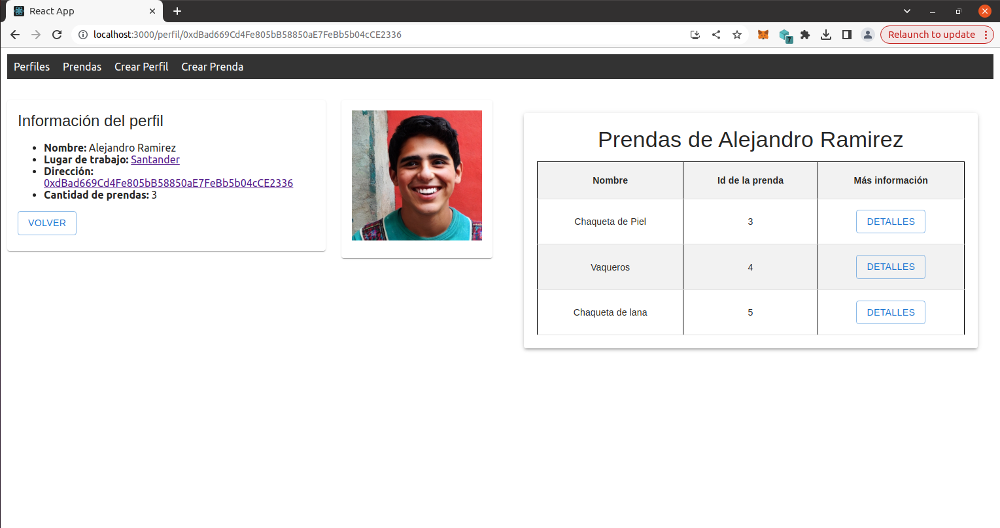
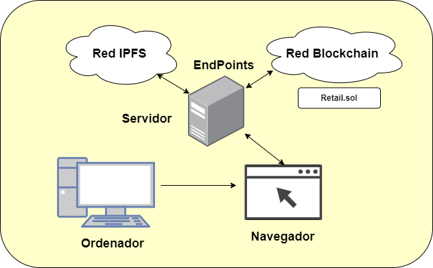

# Proyecto sobre Retail de Pablo Ruiz Giles

## Objetivos

El proyecto tiene como objetivo principal la creación de una aplicación orientada al sector del Retail. El enfoque central es proporcionar un valor agregado a las prendas de vestir al revelar información sobre la procedencia de los materiales y el fabricante de cada prenda. La intención es establecer una conexión más significativa entre los consumidores y la ropa que adquieren, permitiéndoles conocer la historia detrás de cada producto.

El contrato inteligente se puede observar en la dirección `0x8b5776FC018283074144031c8459588B663aB333` de [Polygon Mumbai](https://mumbai.polygonscan.com/address/0x8b5776FC018283074144031c8459588B663aB333).

## Requisitos

Los siguientes requisitos previos son necesarios para ejecutar el proyecto:

- **Tokens de la red Polygon:** Se requieren tokens de la red Polygon para interactuar con la dapp y los smart contracts.

- **Configuración de MetaMask:** Es esencial configurar MetaMask con la red de Polygon para realizar transacciones de manera adecuada.

- **Nodo de IPFS en funcionamiento:** Debe contar con un nodo de IPFS operativo para la interacción con la red IPFS, utilizada para el almacenamiento de contenido digital.

- **Sistema Operativo Ubuntu 20.04:** El proyecto se desarrolló y probó en Ubuntu 20.04, por lo que se recomienda usar esta versión para garantizar la compatibilidad y evitar problemas de configuración.

- **Navegador web compatible:** Debe utilizar un navegador web compatible, como Google Chrome o Mozilla Firefox, para interactuar con las aplicaciones web y las interfaces de usuario de la DAO.

- **HDWalletProvider:** Este paquete es necesario para poder ejecutar los scripts con Truffle.

- **IPFS Companion:** Hay que tener habilitada la extensión para permitir una velocidad superior a la hora de la visualización de los NFT.


## Instalación

Para la instalación de este prototipo, únicamente será necesario seguir los siguientes pasos.

1. Clona el repositorio en tu máquina local:
```
git clone https://github.com/Pablo-Ruiz-Giles1/Retail.git
```

2. Navega al directorio raíz del proyecto:
```
cd Retail
```

Una vez dentro de la carpeta raíz, deberemos acceder a cada subcarpeta y ejecutar el siguiente comando:
```
npm install
```
Una vez instalado todos los paquetes, habrá que instalar las siguientes extensiones en el navegador web

- Metamask
- IPFS Companion


Tras realazrlo, si se quiere arrancar la alpicación, habrá que irse a la carpeta de **IPFS** y ejecutar los siguientes comandos:
```
sudo sysctl -w net.core.rmem_max=2500000

npx ipfs daemon
```
Tras realizarlo, podrá ejecutar la Dapp, navegando a la carpeta dapp y ejecutando el comando:
```
npm start
```

Se podrá observar la siguiente iamgen de la dapp en el navegador



# Arquitectura del Proyecto

Este documento describe la arquitectura del proyecto, proporcionando una visión general del flujo de información y la interconexión de los componentes. A continuación, se presenta una explicación detallada:

## Representación Gráfica



## Componentes del Proyecto:

1. **Navegador con Metamask e IPFS Companion:**
   - El usuario accede al proyecto a través de un navegador web estándar.
   - Metamask y IPFS Companion son extensiones instaladas en el navegador para facilitar la interacción con la red blockchain y el IPFS.

2. **Servidor:**
   - Actúa como intermediario entre el usuario y los servicios descentralizados.
   - Aloja el nodo IPFS y la DApp, gestionando las solicitudes del usuario y proporcionando acceso a los servicios necesarios.

3. **DApp (Aplicación Descentralizada):**
   - Interfaz de usuario para realizar acciones en el proyecto.
   - Se comunica con la red IPFS para el almacenamiento y recuperación descentralizada de datos.

4. **Red IPFS:**
   - Almacenamiento y recuperación descentralizada de información.
   - La DApp se conecta a través del endpoint IPFS para interactuar con la red.

5. **Red Blockchain (a través de Infura):**
   - La DApp se conecta a la red blockchain utilizando un endpoint proporcionado por Infura.
   - En la red blockchain, reside el smart contract del proyecto.

   ## Estructura de directorios


El proyecto está organizado en distintas carpetas para una mejor gestión y estructura. A continuación, se detalla la estructura de cada una de ellas:

### Truffle

La carpeta `Truffle` contiene todos los componentes necesarios para el desarrollo y despliegue del smart contracts utilizado. Su estructura interna incluye:

- `contracts`: Contiene el smart contract desarrollado en Solidity.

- `migrations`: Contiene archivos de migración que definen el orden y la configuración para desplegar los smart contracts en la red.

- `scripts`: Contiene scripts de JavaScript que facilitan la interacción y pruebas con los smart contracts durante el desarrollo.

- `truffle-config.js`: Este archivo configura la interacción de Truffle con la red blockchain seleccionada, definiendo detalles como las redes disponibles y proveedores de red.

### IPFS

La carpeta `IPFS` contiene archivos necesarios para el funcionamiento del nodo de IPFS, obtenidos mediante la instalación de IPFS mediante npm, permitiendo la interacción con la red IPFS.

### Dapp

La carpeta `Dapp` alberga archivos generados en JavaScript para la creación de la interfaz web de la aplicación de Retail.

## Contacto

Este trabajo se ha realizado por Pablo Ruiz Giles. Para más información ponerse en contacto a través de la cuenta de correo electrónico p.rgiles@alumnos.upm.es.


